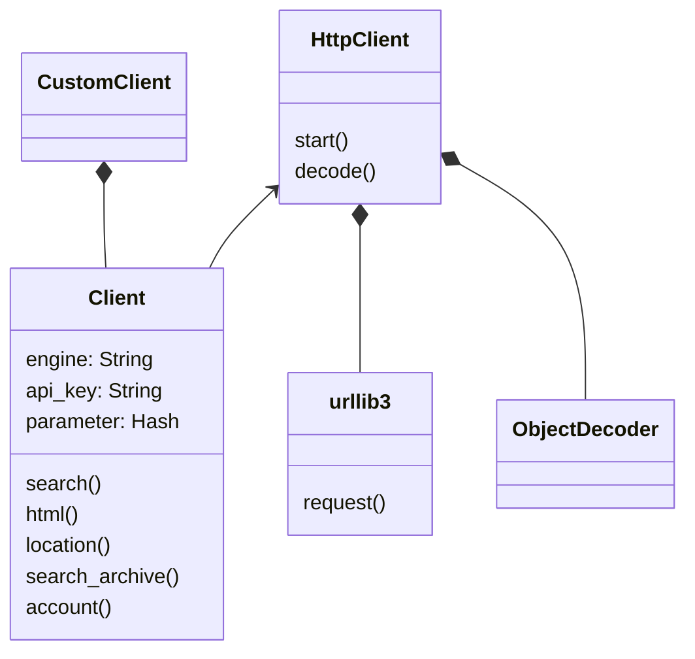
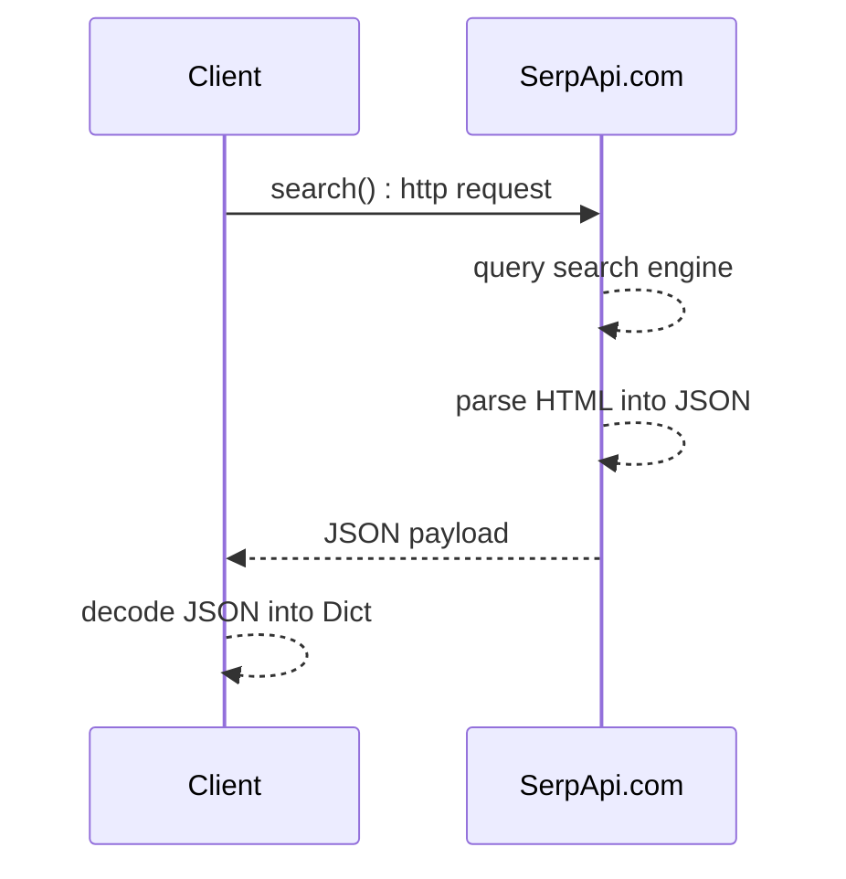

# User guide
[](https://github.com/serpapi/serpapi-python/actions/workflows/ci.yml)

[SerpApi]](https://serpapi.com) allows to scrape any search engine results. 
 It's easy, fast, easy, feature rich, cost effective, scalable and reliable.

This Python 3 library is meant to scrape and parse results from all major search engines available world wide including Google, Bing, Baidu, Yandex, Yahoo, Ebay, Home depot, Apple and more using [SerpApi]](https://serpapi.com).
This is an open source project hosted under https://github.com/serpapi/serpapi-python.

SerpApi.com provides a [script builder]](https://serpapi.com/demo) to get you started quickly.

## Installation
SerpApi can be installed with pip.

```sh
$ python -m pip install serpapi
```

## Quick start
First things first, import the serpapi module:

```python
import serpapi
```
You'll need a client instance to make a search. This object handles all of the details of connection pooling and thread safety so that you don't have to:

```python
client = serpapi.Client()
```
To make a search using SerpApi.com:

```python
parameter = {
  api_key: "secret_api_key", # from serpapi.com
  engine: "google",     # search engine
  q: "coffee",          # search topic
  location: "Austin,TX" # location
}
results = searpapi.search(parameter)
```
Putting everything together.
```python
import serpapi

parameter = {
  api_key: "secret_api_key", # from serpapi.com
  engine: "google",     # search engine
  q: "coffee",          # search topic
  location: "Austin,TX" # location
}
results = searpapi.search(parameter)
print(results)
```

### Advanced settings
SerpApi Client uses urllib3 under the hood.
Optionally, rhe HTTP connection can be tuned:
  - timeout : connection timeout by default 60s
  - retries : attempt to reconnect if the connection failed by default: False. 
   serpapi is reliable at 99.99% but your company network might not be as stable.

  ```python
parameter = {
   retries: 5,
   timeout: 4.0,
   # extra user parameters
}
```

for more details: [URL LIB3 documentation]](https://urllib3.readthedocs.io/en/stable/user-guide.html)

## Basic example per search engines
### Search Bing
```python
import serpapi
import pprint
import os

client = serpapi.Client({
'engine': 'bing',
'api_key': os.getenv("API_KEY")
})
data = client.search({
'q': 'coffee', 
})
pp = pprint.PrettyPrinter(indent=2)
pp.pprint(data['organic_results'])
# os.getenv("API_KEY") captures the secret user API available from http://serpapi.com
```
 test: tests/example_search_bing.py
see: [https://serpapi.com/bing-search-api](https://serpapi.com/bing-search-api)

### Search Baidu
```python
import serpapi
import pprint
import os

client = serpapi.Client({
'engine': 'baidu',
'api_key': os.getenv("API_KEY")
})
data = client.search({
'q': 'coffee', 
})
pp = pprint.PrettyPrinter(indent=2)
pp.pprint(data['organic_results'])
# os.getenv("API_KEY") captures the secret user API available from http://serpapi.com
```
 test: tests/example_search_baidu.py
see: [https://serpapi.com/baidu-search-api](https://serpapi.com/baidu-search-api)

### Search Yahoo
```python
import serpapi
import pprint
import os

client = serpapi.Client({
'engine': 'yahoo',
'api_key': os.getenv("API_KEY")
})
data = client.search({
'p': 'coffee', 
})
pp = pprint.PrettyPrinter(indent=2)
pp.pprint(data['organic_results'])
# os.getenv("API_KEY") captures the secret user API available from http://serpapi.com
```
 test: tests/example_search_yahoo.py
see: [https://serpapi.com/yahoo-search-api](https://serpapi.com/yahoo-search-api)

### Search Youtube
```python
import serpapi
import pprint
import os

client = serpapi.Client({
'engine': 'youtube',
'api_key': os.getenv("API_KEY")
})
data = client.search({
'search_query': 'coffee', 
})
pp = pprint.PrettyPrinter(indent=2)
pp.pprint(data['video_results'])
# os.getenv("API_KEY") captures the secret user API available from http://serpapi.com
```
 test: tests/example_search_youtube.py
see: [https://serpapi.com/youtube-search-api](https://serpapi.com/youtube-search-api)

### Search Walmart
```python
import serpapi
import pprint
import os

client = serpapi.Client({
'engine': 'walmart',
'api_key': os.getenv("API_KEY")
})
data = client.search({
'query': 'coffee', 
})
pp = pprint.PrettyPrinter(indent=2)
pp.pprint(data['organic_results'])
# os.getenv("API_KEY") captures the secret user API available from http://serpapi.com
```
 test: tests/example_search_walmart.py
see: [https://serpapi.com/walmart-search-api](https://serpapi.com/walmart-search-api)

### Search Ebay
```python
import serpapi
import pprint
import os

client = serpapi.Client({
'engine': 'ebay',
'api_key': os.getenv("API_KEY")
})
data = client.search({
'_nkw': 'coffee', 
})
pp = pprint.PrettyPrinter(indent=2)
pp.pprint(data['organic_results'])
# os.getenv("API_KEY") captures the secret user API available from http://serpapi.com
```
 test: tests/example_search_ebay.py
see: [https://serpapi.com/ebay-search-api](https://serpapi.com/ebay-search-api)

### Search Naver
```python
import serpapi
import pprint
import os

client = serpapi.Client({
'engine': 'naver',
'api_key': os.getenv("API_KEY")
})
data = client.search({
'query': 'coffee', 
})
pp = pprint.PrettyPrinter(indent=2)
pp.pprint(data['ads_results'])
# os.getenv("API_KEY") captures the secret user API available from http://serpapi.com
```
 test: tests/example_search_naver.py
see: [https://serpapi.com/naver-search-api](https://serpapi.com/naver-search-api)

### Search Home Depot
```python
import serpapi
import pprint
import os

client = serpapi.Client({
'engine': 'home_depot',
'api_key': os.getenv("API_KEY")
})
data = client.search({
'q': 'table', 
})
pp = pprint.PrettyPrinter(indent=2)
pp.pprint(data['products'])
# os.getenv("API_KEY") captures the secret user API available from http://serpapi.com
```
 test: tests/example_search_home_depot.py
see: [https://serpapi.com/home-depot-search-api](https://serpapi.com/home-depot-search-api)

### Search Apple App Store
```python
import serpapi
import pprint
import os

client = serpapi.Client({
'engine': 'apple_app_store',
'api_key': os.getenv("API_KEY")
})
data = client.search({
'term': 'coffee', 
})
pp = pprint.PrettyPrinter(indent=2)
pp.pprint(data['organic_results'])
# os.getenv("API_KEY") captures the secret user API available from http://serpapi.com
```
 test: tests/example_search_apple_app_store.py
see: [https://serpapi.com/apple-app-store](https://serpapi.com/apple-app-store)

### Search Duckduckgo
```python
import serpapi
import pprint
import os

client = serpapi.Client({
'engine': 'duckduckgo',
'api_key': os.getenv("API_KEY")
})
data = client.search({
'q': 'coffee', 
})
pp = pprint.PrettyPrinter(indent=2)
pp.pprint(data['organic_results'])
# os.getenv("API_KEY") captures the secret user API available from http://serpapi.com
```
 test: tests/example_search_duckduckgo.py
see: [https://serpapi.com/duckduckgo-search-api](https://serpapi.com/duckduckgo-search-api)

### Search Google Search
```python
import serpapi
import pprint
import os

client = serpapi.Client({
'engine': 'google',
'api_key': os.getenv("API_KEY")
})
data = client.search({
'q': 'coffee', 
'engine': 'google', 
})
pp = pprint.PrettyPrinter(indent=2)
pp.pprint(data['organic_results'])
# os.getenv("API_KEY") captures the secret user API available from http://serpapi.com
```
 test: tests/example_search_google_search.py
see: [https://serpapi.com/search-api](https://serpapi.com/search-api)

### Search Google Scholar
```python
import serpapi
import pprint
import os

client = serpapi.Client({
'engine': 'google_scholar',
'api_key': os.getenv("API_KEY")
})
data = client.search({
'q': 'coffee', 
})
pp = pprint.PrettyPrinter(indent=2)
pp.pprint(data['organic_results'])
# os.getenv("API_KEY") captures the secret user API available from http://serpapi.com
```
 test: tests/example_search_google_scholar.py
see: [https://serpapi.com/google-scholar-api](https://serpapi.com/google-scholar-api)

### Search Google Autocomplete
```python
import serpapi
import pprint
import os

client = serpapi.Client({
'engine': 'google_autocomplete',
'api_key': os.getenv("API_KEY")
})
data = client.search({
'q': 'coffee', 
})
pp = pprint.PrettyPrinter(indent=2)
pp.pprint(data['suggestions'])
# os.getenv("API_KEY") captures the secret user API available from http://serpapi.com
```
 test: tests/example_search_google_autocomplete.py
see: [https://serpapi.com/google-autocomplete-api](https://serpapi.com/google-autocomplete-api)

### Search Google Product
```python
import serpapi
import pprint
import os

client = serpapi.Client({
'engine': 'google_product',
'api_key': os.getenv("API_KEY")
})
data = client.search({
'q': 'coffee', 
'product_id': '4172129135583325756', 
})
pp = pprint.PrettyPrinter(indent=2)
pp.pprint(data['product_results'])
# os.getenv("API_KEY") captures the secret user API available from http://serpapi.com
```
 test: tests/example_search_google_product.py
see: [https://serpapi.com/google-product-api](https://serpapi.com/google-product-api)

### Search Google Reverse Image
```python
import serpapi
import pprint
import os

client = serpapi.Client({
'engine': 'google_reverse_image',
'api_key': os.getenv("API_KEY")
})
data = client.search({
'image_url': 'https://i.imgur.com/5bGzZi7.jpg', 
})
pp = pprint.PrettyPrinter(indent=2)
pp.pprint(data['image_sizes'])
# os.getenv("API_KEY") captures the secret user API available from http://serpapi.com
```
 test: tests/example_search_google_reverse_image.py
see: [https://serpapi.com/google-reverse-image](https://serpapi.com/google-reverse-image)

### Search Google Events
```python
import serpapi
import pprint
import os

client = serpapi.Client({
'engine': 'google_events',
'api_key': os.getenv("API_KEY")
})
data = client.search({
'q': 'coffee', 
})
pp = pprint.PrettyPrinter(indent=2)
pp.pprint(data['events_results'])
# os.getenv("API_KEY") captures the secret user API available from http://serpapi.com
```
 test: tests/example_search_google_events.py
see: [https://serpapi.com/google-events-api](https://serpapi.com/google-events-api)

### Search Google Local Services
```python
import serpapi
import pprint
import os

client = serpapi.Client({
'engine': 'google_local_services',
'api_key': os.getenv("API_KEY")
})
data = client.search({
'q': 'Electrician', 
'place_id': 'ChIJOwg_06VPwokRYv534QaPC8g', 
})
pp = pprint.PrettyPrinter(indent=2)
pp.pprint(data['local_ads'])
# os.getenv("API_KEY") captures the secret user API available from http://serpapi.com
```
 test: tests/example_search_google_local_services.py
see: [https://serpapi.com/google-local-services-api](https://serpapi.com/google-local-services-api)

### Search Google Maps
```python
import serpapi
import pprint
import os

client = serpapi.Client({
'engine': 'google_maps',
'api_key': os.getenv("API_KEY")
})
data = client.search({
'q': 'pizza', 
'll': '@40.7455096,-74.0083012,15.1z', 
'type': 'search', 
})
pp = pprint.PrettyPrinter(indent=2)
pp.pprint(data['local_results'])
# os.getenv("API_KEY") captures the secret user API available from http://serpapi.com
```
 test: tests/example_search_google_maps.py
see: [https://serpapi.com/google-maps-api](https://serpapi.com/google-maps-api)

### Search Google Jobs
```python
import serpapi
import pprint
import os

client = serpapi.Client({
'engine': 'google_jobs',
'api_key': os.getenv("API_KEY")
})
data = client.search({
'q': 'coffee', 
})
pp = pprint.PrettyPrinter(indent=2)
pp.pprint(data['jobs_results'])
# os.getenv("API_KEY") captures the secret user API available from http://serpapi.com
```
 test: tests/example_search_google_jobs.py
see: [https://serpapi.com/google-jobs-api](https://serpapi.com/google-jobs-api)

### Search Google Play
```python
import serpapi
import pprint
import os

def test_search_google_play(self):
client = serpapi.Client({
'engine': 'google_play',
'api_key': os.getenv("API_KEY")
})
data = client.search({
'q': 'kite', 
'store': 'apps', 
})
pp = pprint.PrettyPrinter(indent=2)
pp.pprint(data['organic_results'])
# os.getenv("API_KEY") captures the secret user API available from http://serpapi.com
```
 test: tests/example_search_google_play.py
see: [https://serpapi.com/google-play-api](https://serpapi.com/google-play-api)

### Search Google Images
```python
import serpapi
import pprint
import os

client = serpapi.Client({
'engine': 'google',
'api_key': os.getenv("API_KEY")
})
data = client.search({
'engine': 'google', 
'tbm': 'isch', 
'q': 'coffee', 
})
pp = pprint.PrettyPrinter(indent=2)
pp.pprint(data['images_results'])
# os.getenv("API_KEY") captures the secret user API available from http://serpapi.com
```
 test: tests/example_search_google_images.py
see: [https://serpapi.com/images-results](https://serpapi.com/images-results)

# Developer Guide
### Key goals
 - High code quality
 - KISS principles
 - Brand centric instead of search engine based
   - No hard coded logic per search engine
 - Simple HTTP client (lightweight, reduced dependency)
   - No magic default values
   - Thread safe
 - Easy to extends
 - Defensive code style (raise custom exception)
 - TDD
 - Best API coding pratice per platform

### Inspiration
The API design was inpired by the most popular Python packages.
 - urllib3 - https://github.com/urllib3/urllib3
 - Boto3 - https://github.com/boto/boto3

### Quality expectation
 - 0 lint issues using pylint `make lint`
 - 99% code coverage running `make test`
 - 100% test passing: `make test`
 
### Client design: Class diagram


## JSON search() : Sequence diagram


## Build flow

This project is automated using a good old Makefile.
To pipe-clean the project run this:
`make`

Open Makefile for more details.
