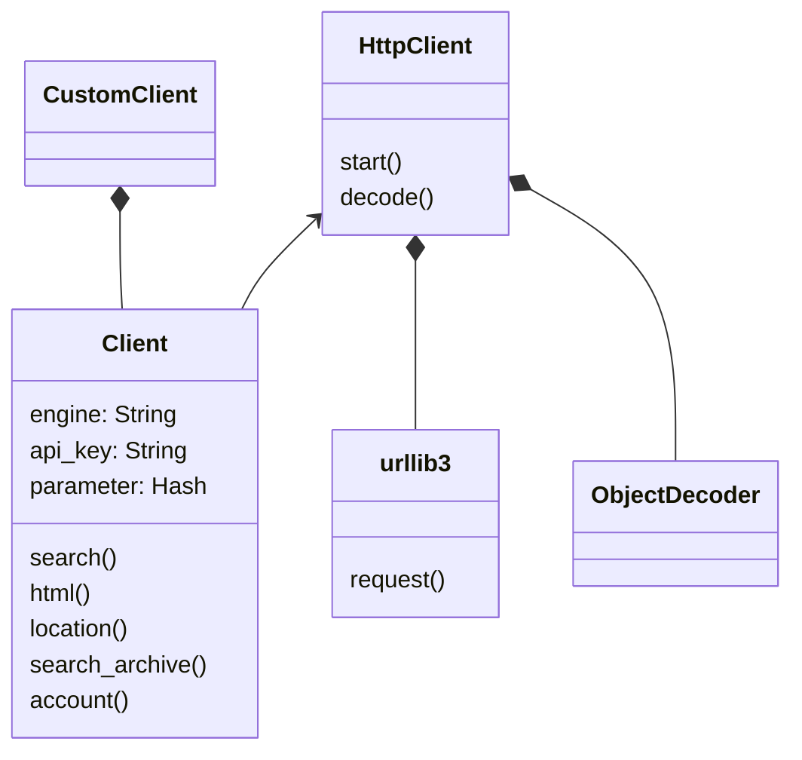
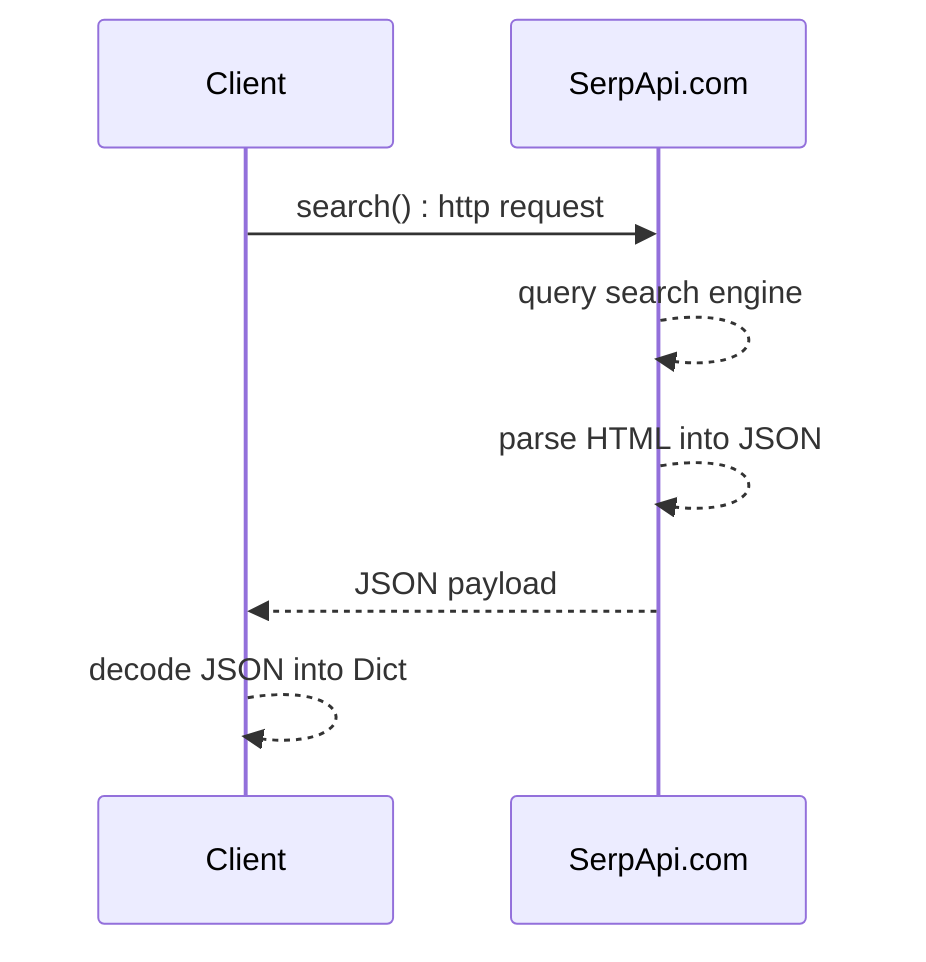

# User guide
[](https://github.com/serpapi/serpapi-python/actions/workflows/ci.yml)

[SerpApi](https://serpapi.com) allows to scrape any search engine results.
It's easy, fast, easy, feature rich, cost effective, scalable and reliable.

This Python 3 library is meant to scrape and parse results from all major search engines available world wide including Google, Bing, Baidu, Yandex, Yahoo, Ebay, Home depot, Apple and more using [SerpApi](https://serpapi.com).
This is an open source project hosted under https://github.com/serpapi/serpapi-python.

SerpApi.com provides a [script builder](https://serpapi.com/demo) to get you started quickly.

## Installation
SerpApi can be installed with pip.

```sh
$ python -m pip install serpapi
```

## Quick start

The following example runs a search for `"coffee"` using your secret API key which you can find at [SerpApi Dashboard](https://serpapi.com/manage-api-key) page. The `serpapi.search` object handles all of the details of connection pooling and thread safety so that you don't have to:

```python
import serpapi

client = serpapi.Client(
  api_key = "secret_api_key", # from serpapi.com
)

parameters = {
  "q": "coffee",
}

results = client.search(parameters)

print(results)
```

### Advanced settings
SerpApi Client uses urllib3 under the hood.

Optionally, the HTTP connection can be tuned:
  - timeout : connection timeout by default 60s
  - retries : attempt to reconnect if the connection failed by default: False. Documentation: https://urllib3.readthedocs.io/en/stable/reference/urllib3.util.html#urllib3.util.Retry
  - api_key : the secret user API available from http://serpapi.com/manage-api-key

   SerpApi's SLA is 99.95% successful searches: https://serpapi.com/faq/general/do-you-provide-sla-guarantees

```python
client = serpapi.Client(
  retries = 5, # or urllib3.util.Retry(connect=5, read=2)
  timeout = 4.2,
  api_key = "secret_api_key", # from serpapi.com
)
```

For more details: [`urllib3` documentation](https://urllib3.readthedocs.io/en/stable/user-guide.html)

## Basic example per search engines


### Search Google Local Services
```python
import serpapi
import pprint
import os

  def test_search_google_local_services(self):
client = serpapi.Client({
    'api_key': os.getenv("API_KEY"),
    'timeout': 61.1,
    'retries': 2
})
data = client.search({
    'engine': 'google_local_services',
    'q': 'Electrician', 
    'place_id': 'ChIJOwg_06VPwokRYv534QaPC8g', 
})
pp = pprint.PrettyPrinter(indent=2)
pp.pprint(data['local_ads'])
```
test: tests/example_search_google_local_services.py
<br>
Documentation: https://serpapi.com/google-local-services-search-api


### Search Baidu
```python
import serpapi
import pprint
import os

client = serpapi.Client({
    'engine': 'baidu',
    'api_key': os.getenv("API_KEY")
  })
data = client.search({
    'q': 'coffee', 
})
pp = pprint.PrettyPrinter(indent=2)
pp.pprint(data['organic_results'])
```
test: tests/example_search_baidu.py
<br>
Documentation: https://serpapi.com/baidu-search-api


### Search Ebay
```python
import serpapi
import pprint
import os

client = serpapi.Client({
    'engine': 'ebay',
    'api_key': os.getenv("API_KEY")
  })
data = client.search({
    '_nkw': 'coffee', 
})
pp = pprint.PrettyPrinter(indent=2)
pp.pprint(data['organic_results'])
```
test: tests/example_search_ebay.py
<br>
Documentation: https://serpapi.com/ebay-search-api


### Search Apple App Store
```python
import serpapi
import pprint
import os

client = serpapi.Client({
    'engine': 'apple_app_store',
    'api_key': os.getenv("API_KEY")
  })
data = client.search({
    'term': 'coffee', 
})
pp = pprint.PrettyPrinter(indent=2)
pp.pprint(data['organic_results'])
```
test: tests/example_search_apple_app_store.py
<br>
Documentation: https://serpapi.com/apple-app-store-search-api


### Search Google Product
```python
import serpapi
import pprint
import os

client = serpapi.Client({
    'engine': 'google_product',
    'api_key': os.getenv("API_KEY")
  })
data = client.search({
    'q': 'coffee', 
    'product_id': '4172129135583325756', 
})
pp = pprint.PrettyPrinter(indent=2)
pp.pprint(data['product_results'])
```
test: tests/example_search_google_product.py
<br>
Documentation: https://serpapi.com/google-product-search-api


### Search Google Maps
```python
import serpapi
import pprint
import os

client = serpapi.Client({
    'engine': 'google_maps',
    'api_key': os.getenv("API_KEY")
  })
data = client.search({
    'q': 'pizza', 
    'll': '@40.7455096,-74.0083012,15.1z', 
    'type': 'search', 
})
pp = pprint.PrettyPrinter(indent=2)
pp.pprint(data['local_results'])
```
test: tests/example_search_google_maps.py
<br>
Documentation: https://serpapi.com/google-maps-search-api


### Search Google Images
```python
import serpapi
import pprint
import os

client = serpapi.Client({
    'engine': 'google',
    'api_key': os.getenv("API_KEY")
  })
data = client.search({
    'engine': 'google', 
    'tbm': 'isch', 
    'q': 'coffee', 
})
pp = pprint.PrettyPrinter(indent=2)
pp.pprint(data['images_results'])
```
test: tests/example_search_google_images.py
<br>
Documentation: https://serpapi.com/google-images-search-api


### Search Google Search
```python
import serpapi
import pprint
import os

client = serpapi.Client({
    'engine': 'google',
    'api_key': os.getenv("API_KEY")
  })
data = client.search({
    'q': 'coffee', 
    'engine': 'google', 
})
pp = pprint.PrettyPrinter(indent=2)
pp.pprint(data['organic_results'])
```
test: tests/example_search_google_search.py
<br>
Documentation: https://serpapi.com/google-search-search-api


### Search Google Jobs
```python
import serpapi
import pprint
import os

client = serpapi.Client({
    'engine': 'google_jobs',
    'api_key': os.getenv("API_KEY")
  })
data = client.search({
    'q': 'coffee', 
})
pp = pprint.PrettyPrinter(indent=2)
pp.pprint(data['jobs_results'])
```
test: tests/example_search_google_jobs.py
<br>
Documentation: https://serpapi.com/google-jobs-search-api


### Search Naver
```python
import serpapi
import pprint
import os

client = serpapi.Client({
    'engine': 'naver',
    'api_key': os.getenv("API_KEY")
  })
data = client.search({
    'query': 'coffee', 
})
pp = pprint.PrettyPrinter(indent=2)
pp.pprint(data['ads_results'])
```
test: tests/example_search_naver.py
<br>
Documentation: https://serpapi.com/naver-search-api


### Search Google Scholar
```python
import serpapi
import pprint
import os

client = serpapi.Client({
    'engine': 'google_scholar',
    'api_key': os.getenv("API_KEY")
  })
data = client.search({
    'q': 'coffee', 
})
pp = pprint.PrettyPrinter(indent=2)
pp.pprint(data['organic_results'])
```
test: tests/example_search_google_scholar.py
<br>
Documentation: https://serpapi.com/google-scholar-search-api


### Search Youtube
```python
import serpapi
import pprint
import os

client = serpapi.Client({
    'engine': 'youtube',
    'api_key': os.getenv("API_KEY")
  })
data = client.search({
    'search_query': 'coffee', 
})
pp = pprint.PrettyPrinter(indent=2)
pp.pprint(data['video_results'])
```
test: tests/example_search_youtube.py
<br>
Documentation: https://serpapi.com/youtube-search-api


### Search Google Reverse Image
```python
import serpapi
import pprint
import os

client = serpapi.Client({
    'engine': 'google_reverse_image',
    'api_key': os.getenv("API_KEY")
  })
data = client.search({
    'image_url': 'https://i.imgur.com/5bGzZi7.jpg', 
})
pp = pprint.PrettyPrinter(indent=2)
pp.pprint(data['image_sizes'])
```
test: tests/example_search_google_reverse_image.py
<br>
Documentation: https://serpapi.com/google-reverse-image-search-api


### Search Yahoo
```python
import serpapi
import pprint
import os

client = serpapi.Client({
    'engine': 'yahoo',
    'api_key': os.getenv("API_KEY")
  })
data = client.search({
    'p': 'coffee', 
})
pp = pprint.PrettyPrinter(indent=2)
pp.pprint(data['organic_results'])
```
test: tests/example_search_yahoo.py
<br>
Documentation: https://serpapi.com/yahoo-search-api


### Search Duckduckgo
```python
import serpapi
import pprint
import os

client = serpapi.Client({
    'engine': 'duckduckgo',
    'api_key': os.getenv("API_KEY")
  })
data = client.search({
    'q': 'coffee', 
})
pp = pprint.PrettyPrinter(indent=2)
pp.pprint(data['organic_results'])
```
test: tests/example_search_duckduckgo.py
<br>
Documentation: https://serpapi.com/duckduckgo-search-api


### Search Bing
```python
import serpapi
import pprint
import os

client = serpapi.Client({
    'engine': 'bing',
    'api_key': os.getenv("API_KEY")
  })
data = client.search({
    'q': 'coffee', 
})
pp = pprint.PrettyPrinter(indent=2)
pp.pprint(data['organic_results'])
```
test: tests/example_search_bing.py
<br>
Documentation: https://serpapi.com/bing-search-api


### Search Google Autocomplete
```python
import serpapi
import pprint
import os

client = serpapi.Client({
    'engine': 'google_autocomplete',
    'api_key': os.getenv("API_KEY")
  })
data = client.search({
    'q': 'coffee', 
})
pp = pprint.PrettyPrinter(indent=2)
pp.pprint(data['suggestions'])
```
test: tests/example_search_google_autocomplete.py
<br>
Documentation: https://serpapi.com/google-autocomplete-search-api


### Search Home Depot
```python
import serpapi
import pprint
import os

client = serpapi.Client({
    'engine': 'home_depot',
    'api_key': os.getenv("API_KEY")
  })
data = client.search({
    'q': 'table', 
})
pp = pprint.PrettyPrinter(indent=2)
pp.pprint(data['products'])
```
test: tests/example_search_home_depot.py
<br>
Documentation: https://serpapi.com/home-depot-search-api


### Search Walmart
```python
import serpapi
import pprint
import os

client = serpapi.Client({
    'engine': 'walmart',
    'api_key': os.getenv("API_KEY")
  })
data = client.search({
    'query': 'coffee', 
})
pp = pprint.PrettyPrinter(indent=2)
pp.pprint(data['organic_results'])
```
test: tests/example_search_walmart.py
<br>
Documentation: https://serpapi.com/walmart-search-api


### Search Google Events
```python
import serpapi
import pprint
import os

client = serpapi.Client({
    'engine': 'google_events',
    'api_key': os.getenv("API_KEY")
  })
data = client.search({
    'q': 'coffee', 
})
pp = pprint.PrettyPrinter(indent=2)
pp.pprint(data['events_results'])
```
test: tests/example_search_google_events.py
<br>
Documentation: https://serpapi.com/google-events-search-api


### Search Google Play
```python
import serpapi
import pprint
import os

  def test_search_google_play(self):
client = serpapi.Client({
    'engine': 'google_play',
    'api_key': os.getenv("API_KEY")
  })
data = client.search({
    'q': 'kite', 
    'store': 'apps', 
})
pp = pprint.PrettyPrinter(indent=2)
pp.pprint(data['organic_results'])
```
test: tests/example_search_google_play.py
<br>
Documentation: https://serpapi.com/google-play-search-api

# Developer Guide
### Key goals
 - High code quality
 - KISS principles
 - Brand centric instead of search engine based
   - No hard coded logic per search engine
 - Simple HTTP client (lightweight, reduced dependency)
   - No magic default values
   - Thread safe
 - Easy to extends
 - Defensive code style (raise custom exception)
 - TDD
 - Best API coding pratice per platform

### Inspiration
The API design was inpired by the most popular Python packages.
 - urllib3 - https://github.com/urllib3/urllib3
 - Boto3 - https://github.com/boto/boto3

### Quality expectation
 - 0 lint issues using pylint `make lint`
 - 99% code coverage running `make test`
 - 100% test passing: `make test`
 
### Client design: Class diagram


## JSON search() : Sequence diagram


## Build flow

This project is automated using a good old Makefile.
To pipe-clean the project run this:
`make`

Open Makefile for more details.
